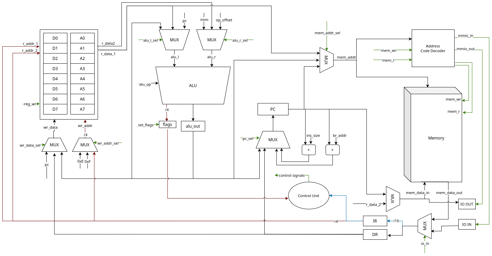

# Лабораторная работа  №3. Схема

**Выполнил**: Косов Артём Андреевич

**Группа**: P3230

**Вариант**: `m68k`

## Изображение схемы

Ссылка на draw.io: https://viewer.diagrams.net/?tags=%7B%7D&lightbox=1&highlight=0000ff&layers=1&nav=1&title=lab3_schema.drawio&dark=auto#Uhttps%3A%2F%2Fdrive.google.com%2Fuc%3Fid%3D18rgrUVSqviet8ImiS_gcUadZTZuR3PNx%26export%3Ddownload
